# Terra-X Mechanical & Electrical Wiring Diagram

Below is the high-level architecture of how all the physical components connect to the central ESP32 Brain and the power distribution system.

*(VS Code can render this diagram automatically if you have a Mermaid extension installed, or you can paste it into Mermaid Live).*

```mermaid
graph TD
    %% Power System
    subgraph Power Distribution
        BATT[2x 18650 Battery Pack 7.4V] --> SWITCH[Main Power Switch]
        SWITCH --> FUSE[Main Fuse]
        FUSE --> L298N_PWR[L298N Motor Driver 12V In]
        FUSE --> BUCK[Buck Converter 5V Out]
        
        BUCK --> ESP_VIN[ESP32 Brain VIN]
        BUCK --> ESPCAM_VIN[ESP32-CAM VIN]
        BUCK --> SERVO_PWR[Servo Power Hub]
    end

    %% ESP32 Brain Core
    subgraph ESP32 Main Brain
        ESP[ESP32 DevKit]
        ESP_I2C[I2C Bus: SDA/SCL]
        ESP_PWM[PWM Output Pins]
        ESP_DIG[Digital I/O Pins]
    end

    %% Swappable & I2C Payloads
    subgraph Sensor Array
        ESP_I2C <-->|I2C| MPU[MPU6050 IMU]
        ESP_I2C <-->|I2C| PORT[Universal Payload Port]
        ESP_DIG <-->|TRIG / ECHO| HC[HC-SR04 Ultrasonic]
        ESP_DIG <-->|DATA| DHT[DHT11 Temp/Humidity]
    end

    %% Locomotion
    subgraph Drivetrain
        ESP_PWM -->|IN1, IN2, ENA| L298N_LEFT[L298N Driver - Left]
        ESP_PWM -->|IN3, IN4, ENB| L298N_RIGHT[L298N Driver - Right]
        
        L298N_LEFT -->|Power| MOT_FL[Front Left Motor]
        L298N_LEFT -->|Power| MOT_RL[Rear Left Motor]
        
        L298N_RIGHT -->|Power| MOT_FR[Front Right Motor]
        L298N_RIGHT -->|Power| MOT_RR[Rear Right Motor]
    end

    %% Actuators & Cone
    subgraph Mechanical Actuators
        ESP_PWM -->|PWM Signal| SG90[SG90 Radar Servo]
        ESP_PWM -->|PWM Signal| MG90S[MG90S Camera Pan Servo]
        
        ESP_DIG -->|Gate Signal| MOS[MOSFET Driver]
        MOS -->|Power| CONE[DC Motor: Rotating Cone]
        
        ESP_DIG -->|Toggle| LED[White LED Headlights]
    end
```

